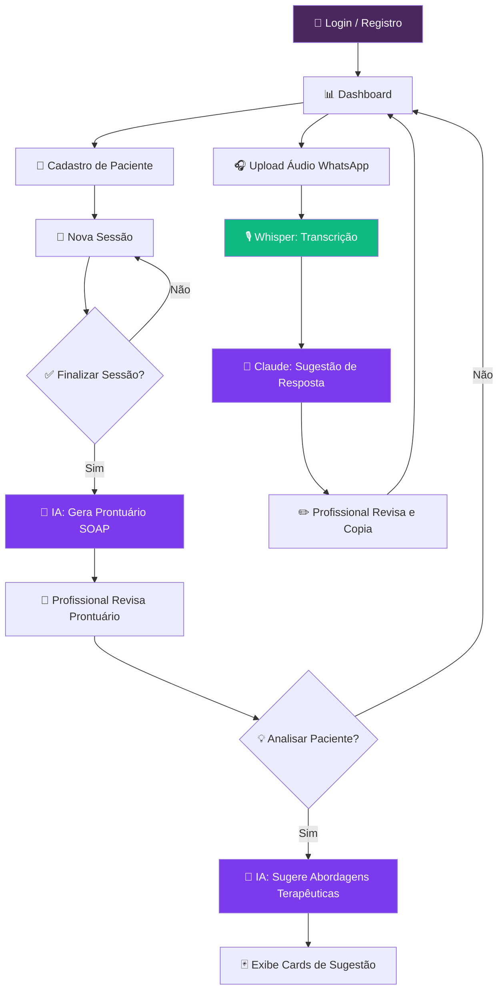
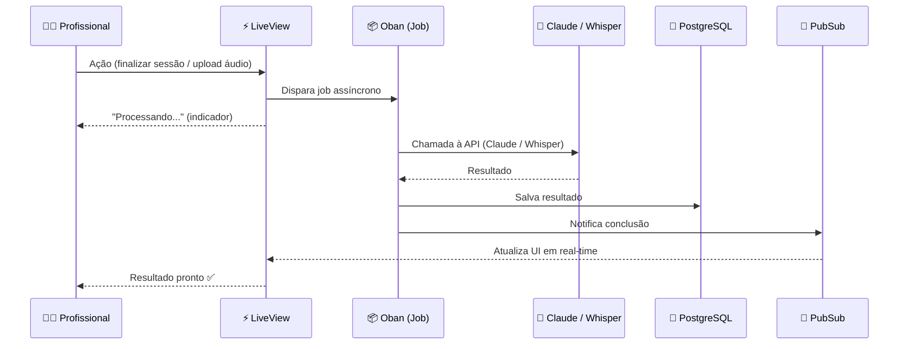
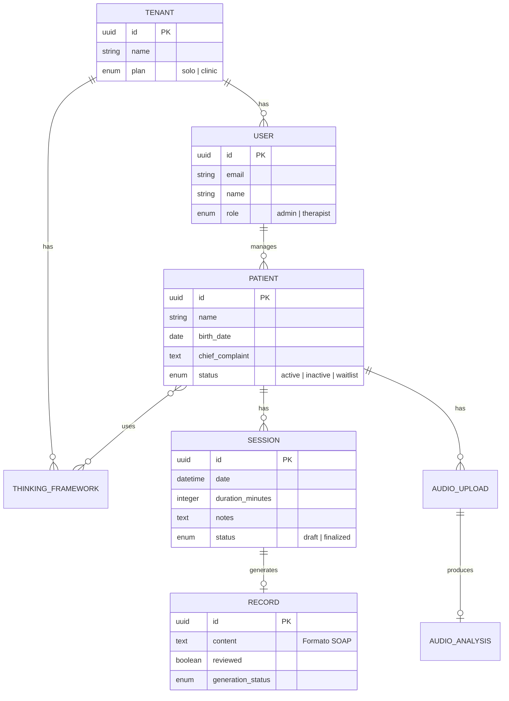

<p align="center">
  
  
  
  
  
  
</p>

<h1 align="center">🧠 PsiCare — Ravanshenasi</h1>

<p align="center">
  <em>🩺 Você cuida do paciente. A IA cuida do registro, da análise e da comunicação.</em>
</p>

<p align="center">
  
  
  
</p>

---

## 📋 Sobre o Projeto

**PsiCare** é um SaaS voltado para **psicólogos e terapeutas** que centraliza o gerenciamento de pacientes, geração de prontuários e assistência por IA — incluindo análise de perfil, sugestão de abordagens terapêuticas e suporte à comunicação via áudio do WhatsApp.

> 🎯 **Problema:** Psicólogos gastam tempo considerável em tarefas administrativas e de registro que poderiam ser assistidas por inteligência artificial.

---

## 🏗️ Stack Tecnológica

| Camada | Tecnologia | Justificativa |
|:---:|:---|:---|
| 💜 **Backend + Web** | Elixir + Phoenix + LiveView | Real-time sem JS complexo, concorrência nativa via BEAM VM |
| 🟢 **Assets & Tooling** | Node.js | Build de assets, dependências JS do LiveView |
| 🐘 **Banco de Dados** | PostgreSQL | Multi-tenant com RLS, robusto para dados clínicos |
| 🤖 **IA — Linguagem** | Anthropic Claude API | Prontuários, análise de perfil, sugestão de respostas |
| 🎙️ **IA — Áudio** | OpenAI Whisper API | Transcrição de áudio em português (pt-BR) |
| 🔐 **Autenticação** | phx.gen.auth | Solução nativa do ecossistema Phoenix |
| ☁️ **Storage** | S3 / Tigris | Upload e armazenamento de arquivos de áudio |
| ⚡ **Jobs Assíncronos** | Oban | Processamento em background (chamadas IA, transcrição) |

---

## ✨ Funcionalidades

| # | Feature | Descrição | IA |
|:---:|:---|:---|:---:|
| 1 | 🔑 **Autenticação & Multi-tenancy** | Login, registro, roles (`admin` / `therapist`), isolamento por tenant | — |
| 2 | 👤 **Cadastro de Pacientes** | Perfil completo, queixa principal, histórico, status, busca e filtros | — |
| 3 | 📝 **Registro de Sessões** | Notas por sessão, rascunho/finalização, vínculo com paciente | — |
| 4 | 📄 **Geração de Prontuário** | Prontuário SOAP gerado automaticamente ao finalizar sessão | 🤖 |
| 5 | 💡 **Sugestão de Abordagens** | Análise do perfil + sugestão de vertentes terapêuticas | 🤖 |
| 6 | 🎧 **Processamento de Áudio** | Upload de áudio WhatsApp → transcrição → sugestão de resposta | 🤖 |
| 7 | 🧩 **Linhas de Pensamento** | TCC, Psicanálise, Gestalt, ACT, DBT, Jung + customizáveis | — |
| 8 | 📊 **Dashboard** | Visão geral: sessões, prontuários pendentes, áudios recentes | — |

---

## 🔄 Fluxograma — Fluxo Principal do Sistema



---

## 🔄 Fluxo de Comunicação com IA



---

## 🗄️ Modelo de Dados (Simplificado)



---

## 🚀 Como Rodar (em breve)

```bash
# 📦 Instalar dependências
mix deps.get
npm install --prefix assets

# 🐘 Configurar banco de dados
mix ecto.setup

# ⚡ Iniciar servidor
mix phx.server
```

> 🌐 Acesse [`localhost:4000`](http://localhost:4000) no navegador.

### 🔑 Variáveis de Ambiente

```env
ANTHROPIC_API_KEY=       # 🤖 Claude API
OPENAI_API_KEY=          # 🎙️ Whisper API
DATABASE_URL=            # 🐘 PostgreSQL
S3_BUCKET=               # ☁️ Storage
S3_ACCESS_KEY=           # ☁️ Storage
S3_SECRET_KEY=           # ☁️ Storage
SECRET_KEY_BASE=         # 🔐 Phoenix
```

---

## 👥 Multi-tenancy

| Modelo | Tipo | Descrição |
|:---:|:---|:---|
| 🏠 **Solo** | Profissional individual | Uma conta, um psicólogo, seus pacientes |
| 🏥 **Clínica** | Múltiplos profissionais | Organização com vários terapeutas, dados isolados por profissional |

> 🛡️ Isolamento via `tenant_id` em todas as tabelas + Row Level Security (RLS) no PostgreSQL.

---

## 🧠 Design Ético da IA

| Princípio | Implementação |
|:---|:---|
| 🚫 Sem diagnósticos definitivos | IA usa linguagem de hipótese ("sugere", "indica", "observa-se") |
| 📝 Revisão humana obrigatória | Todo output é editável pelo profissional antes do uso |
| 🔒 Privacidade de dados | Dados de pacientes nunca enviados sem consentimento nos termos de uso |
| 📋 Auditoria | Logs de chamadas à API armazenados com `tenant_id` |
| 🎯 Contexto fiel | IA nunca inventa informações — trabalha apenas com dados fornecidos |

---

## 📍 Roadmap

- [x] 📐 Definição de arquitetura e modelo de dados
- [x] 🤖 Design dos prompts de IA
- [ ] 🔑 Autenticação e multi-tenancy
- [ ] 👤 CRUD de pacientes
- [ ] 📝 Registro de sessões
- [ ] 📄 Geração de prontuários (IA)
- [ ] 💡 Sugestão de abordagens (IA)
- [ ] 🎧 Processamento de áudio (IA)
- [ ] 🧩 Configuração de linhas de pensamento
- [ ] 📊 Dashboard
- [ ] 📱 App mobile (Fase 2)

---

<p align="center">
  Feito com 💜 usando <strong>Elixir</strong>, <strong>Phoenix</strong> e <strong>BEAM VM</strong>
</p>
